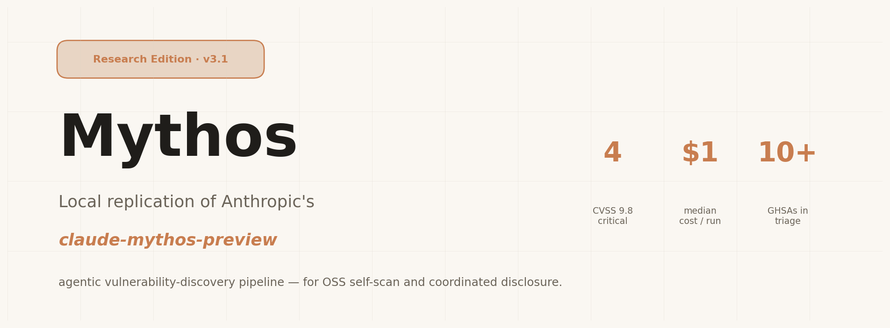
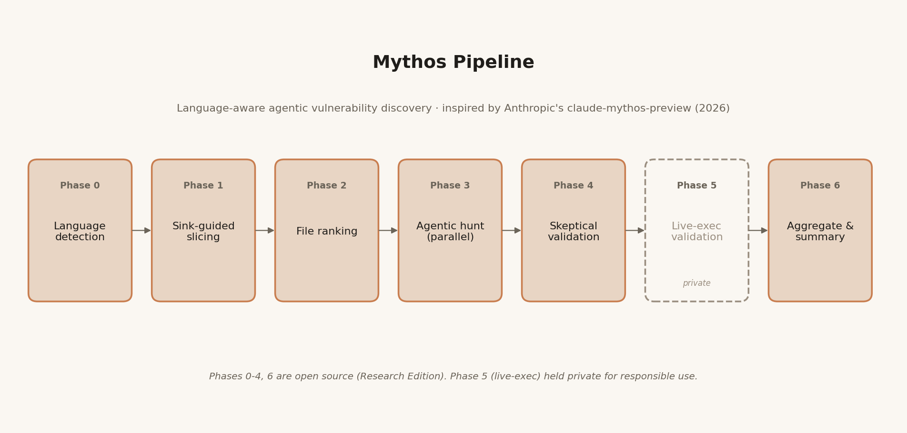
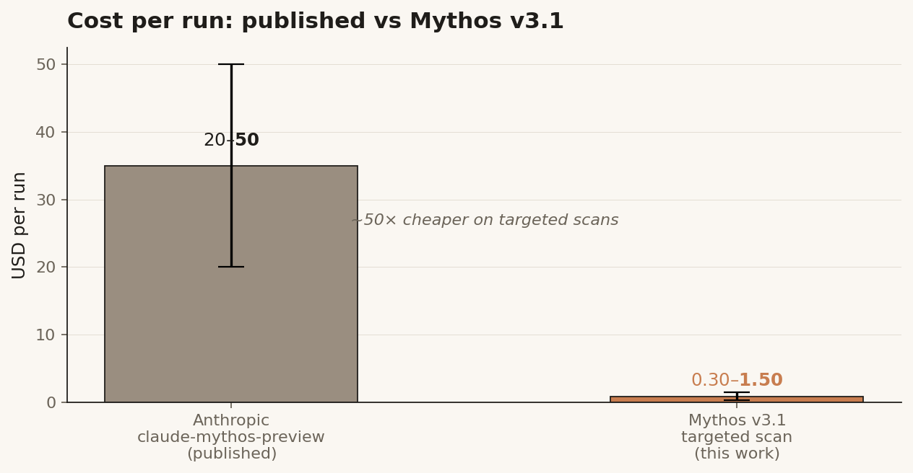

<p align="center">
  
</p>

<h1 align="center">Mythos Research Edition</h1>

<p align="center">
  <sub>A local, open-source scaffold for agentic vulnerability discovery.<br/>
  Inspired by Anthropic's <a href="https://red.anthropic.com/2026/mythos-preview/"><code>claude-mythos-preview</code></a> (Project Glasswing, April 2026).</sub>
</p>

<p align="center">
  <a href="https://doi.org/10.5281/zenodo.19727857"></a>
  <a href="LICENSE"></a>
  <a href="https://github.com/Keyvanhardani/mythos-research/releases/latest"></a>
  <a href="dist/Mythos-Research-Edition.pdf"></a>
  <a href="https://orcid.org/0009-0000-6003-8826"></a>
  
  
</p>


---

## What this is

**Mythos Research Edition** is a reproducible scaffold for running an *agentic* security review over an
open-source codebase, using a general-purpose frontier LLM via [Claude Code CLI](https://github.com/anthropics/claude-code).
It is the community-facing subset of a larger internal toolchain; the live-exploit-verification stage is
deliberately held out of this repository — see [Scope](#scope).

Mythos was built as a **replication experiment** against Anthropic's
[claude-mythos-preview](https://red.anthropic.com/2026/mythos-preview/) announcement (2026-04-20):
*can a local scaffold with a general-purpose frontier model, without the special model checkpoint Anthropic
tested on OpenBSD and CyberGym, reproduce a meaningful fraction of their vulnerability-discovery workflow?*

The answer, summarised: **yes, for targeted scans and at roughly ~50× lower cost per run**, with the important
caveat that the heaviest exploit-development tasks still favour Anthropic's internal preview model.

## Pipeline

<p align="center">
  
</p>

Seven phases, parameterised. Phases 0–4 and 6 are open in this edition.
**Phase 5 (live-exec validation) is held private** and not included — see [Scope](#scope).

- **Phase 0 — Language detection.** Dominant language of the target tree → selects a language-specific
  *vulnerability-semantics prompt* (`prompts/vsp-<lang>.md`).
- **Phase 1 — Sink-guided slicing.** A language-specific sink catalog (`scripts/lib/sinks/*.txt`) is
  ripgrep'd across the target, producing an NDJSON of `{category, pattern, file, line, snippet}` hits.
- **Phase 2 — File ranking.** Files are tiered by sink-category density. High-yield categories
  (deserialization, code-eval, SQL injection, prototype pollution, XXE, framework footguns, sanitiser
  gaps, browser-API footguns) dominate; files whose matches are all in `SAFE_*` variants are demoted.
- **Phase 3 — Agentic hunt.** One Claude-Code subagent per top-ranked file, parallelised. The agent is
  given the per-file sink slice, the VSP, and (optionally) a per-run **diversity focus hint**.
- **Phase 4 — Skeptical validation.** A second-pass agent re-reads the source and the finding with an
  explicit *skeptical reviewer* framing. Output:
  `CONFIRMED | FALSE_POSITIVE | DOWNGRADED | NEEDS_MORE_INFO`.
- **Phase 6 — Aggregate.** JSON summary with severity breakdown, per-phase cost telemetry, and the
  validator verdict for each finding.

## Cost, roughly

<p align="center">
  
</p>

Mythos targeted scans (≤ 10 files, `--budget 3.00` per hunter) land at **$0.30 – $1.50 per run** on
`claude-opus-4-7`. Anthropic's published Glasswing runs on `claude-mythos-preview` are in the
**$20 – $50** range per run. The gap is mostly the scope (1000 files vs 8) and the model
choice (internal preview vs general-purpose). For self-scanning an individual OSS project, the
cheap end is sufficient.

## Diversity seeding (the Anthropic-replication point)

Anthropic's key insight is that sampling diverse traces from the same input dramatically increases
bug-discovery breadth. Mythos v3 adapts this with **`--pass-at-k K`**: K independent hunter runs per
file, each seeded with a different *focus hint* drawn from (a) the sink categories present in the file,
(b) lengthy function names (rough entry-point heuristic), and (c) input markers (`@app.route`,
`socket.on`, `req.body`).

Empirically: `K = 2..3` catches distinct classes of findings in the same file without exploding cost.
`K = 1` is the v2-compatible default.

## Quick start

```bash
# 1) clone
git clone https://github.com/Keyvanhardani/mythos-research.git
cd mythos-research

# 2) make sure Claude Code CLI is available
claude --version

# 3) run against a target directory (read-only)
bash scripts/mythos-v3.sh /path/to/target --max-files 8 --budget 3.00

# optional: diverse sampling (K independent hunters per file)
bash scripts/mythos-v3.sh /path/to/target --pass-at-k 3

# optional: skip everything that would need exec-validator.sh
bash scripts/mythos-v3.sh /path/to/target --skip-exec
```

Reports land in `reports/<scan-id>/summary.json` and per-file `findings/` + `validated/` JSONs.

## Scope

**In scope for this repository:** finding-first pipeline, sink catalogues, ranker, hunter & validator
prompts, the seven-phase orchestrator, the diversity-seeding driver, a light hybrid-tools wrapper for
combining classical static analysis with the agentic pass.

**Out of scope — held private:** the Phase 5 live-exec validator (`exec-validator.sh` + its prompt),
the exploit-sketch stage (`exploit-sketch.md`), per-run PoC generators, and any target-specific tuning
accumulated during real scans. These are kept outside this repository to keep Mythos a **research
scaffold**, not a turn-key exploitation framework.

If Phase 5 is referenced in `mythos-v3.sh`, the script detects the missing `exec-validator.sh` and
automatically skips it with a clear notice — no errors, no half-runs.

## Responsible disclosure

This is a security-research tool. The intended uses are:

- OSS maintainers self-scanning their own projects before release
- Security researchers running Mythos over projects they have authorisation to audit
- Academic replication of Anthropic's methodology

If Mythos surfaces a real vulnerability, please follow the upstream project's coordinated-disclosure
process. Do **not** publish PoCs before the vendor has acknowledged and patched.

See [`SECURITY.md`](SECURITY.md) for details.

## Limitations, honestly

- **Sink catalogues are not exhaustive.** The GLib / GObject / json-glib family in particular is not
  yet covered in `sinks/c-cpp.txt`; PRs welcome.
- **Ranker bias toward small, high-sink-density files.** Mega-files (> 2500 LOC) are currently
  skipped — that's a meaningful gap for large parser files.
- **Model matters.** `claude-opus-4-7` is a strong general model but the heaviest exploit-development
  tasks in Anthropic's Glasswing report were done on `claude-mythos-preview`, a specialised
  checkpoint not publicly available. Expect Mythos to be better at *finding* than at *exploiting*.
- **No Docker isolation yet.** Hunters read the target tree directly; running against untrusted
  codebases locally is at your own risk.

## Evolution (version history)

Mythos went through three scaffolded iterations — all three are present for pedagogical reference:

- **`scripts/archive/mythos-scan.sh`** — v1, original main orchestrator. Simpler, no
  sink-slicer.
- **`scripts/archive/mythos-v2.sh`** — v2, adds sink-slicing + ranker + skeptical validator.
- **`scripts/mythos-v3.sh`** — v3 (current). Adds per-run diversity seeding, pass@k, per-phase cost
  telemetry, and the Phase 5 hook (held private).
- **`scripts/archive/pass-at-k.sh`** — the v2-era standalone diversity driver; in v3 this is folded
  into the main orchestrator via `--pass-at-k K`.

See [`CHANGELOG.md`](CHANGELOG.md) for the prose version.

## Acknowledgements

Mythos Research Edition is an **outside-in replication** of Anthropic's published research:

- **Project Glasswing** / `claude-mythos-preview` — Anthropic's red-team research release, April 2026.
  [red.anthropic.com/2026/mythos-preview/](https://red.anthropic.com/2026/mythos-preview/)

The sink-catalog approach draws on decades of static-analysis practice (Semgrep, CodeQL, cppcheck,
Coverity); the agentic-hunter shape is contemporaneous work by many groups and is, at its core, the
same pattern Anthropic describes in their paper.

## Further reading

- [`RESEARCH.md`](RESEARCH.md) — full research analysis: what Glasswing actually does, the benchmark
  gap, what scaffolding can and cannot close, prompting techniques that work, multi-agent patterns.
- [`dist/Mythos-Research-Edition.pdf`](dist/Mythos-Research-Edition.pdf) — the same report as a
  publication-ready PDF (Charter / DejaVu Sans, TU Darmstadt-style formatting).
- [`paper/`](paper/) — arXiv-ready LaTeX source (`paper.tex` + `references.bib` + `Makefile`).
- [`scripts/V3_DESIGN.md`](scripts/V3_DESIGN.md) — v3 design doc (goals, deltas to v2, metrics).

## Cite

If you use Mythos Research Edition in academic or professional work, please cite the report and the
repository. A machine-readable `CITATION.cff` is provided at the repository root; GitHub renders a
"Cite this repository" button from it. Suggested BibTeX:

```bibtex
@techreport{hardani2026mythosResearch,
  author       = {Hardani, Keyvan},
  title        = {An Outside-In Replication of Project Glasswing: Mythos Research Edition},
  institution  = {Independent},
  year         = {2026},
  month        = apr,
  doi          = {10.5281/zenodo.19727857},
  url          = {https://doi.org/10.5281/zenodo.19727857},
  note         = {ORCID 0009-0000-6003-8826.
                  Concept DOI; for version-specific citation use
                  10.5281/zenodo.19727858 (v1.0.2).}
}
```

## License

Apache License 2.0. See [`LICENSE`](LICENSE).

For human reading: you may use, modify and redistribute this code for lawful purposes, including
commercial. You may not use it to attack systems you have no authorisation to audit. Coordinated
disclosure is expected for any vulnerability surfaced with Mythos's help.

## Author

**Keyvan Hardani** — Applied AI Researcher · Engineer.
[keyvan.ai](https://keyvan.ai) · [github.com/Keyvanhardani](https://github.com/Keyvanhardani) · [linkedin.com/in/keyvanhardani](https://linkedin.com/in/keyvanhardani) · ORCID [0009-0000-6003-8826](https://orcid.org/0009-0000-6003-8826) · [hello@keyvan.ai](mailto:hello@keyvan.ai)
